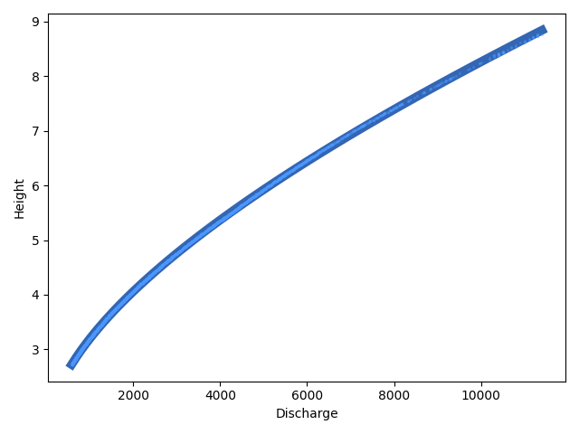

# Chattahoochee River predictions
## Above Roswell USGS river gage

Provides a daily forecast of Chattahoochee River height and flow rate at the Above Roswell gage.

## Data sources

Input data is taken from USGS water monitoring stations and the USACE dam generation schedule.

### USGS data
USGS data is available at

`https://nwis.waterservices.usgs.gov/nwis/iv/?sites=[location_code]&agencyCd=USGS&startDT=[YYYY-MM-DDTHH:MM:SS.MMM-TZ:00]&endDT=[YYYY-MM-DDTHH:MM:SS.MMM-TZ:00]&parameterCd=000[parameter_code]&format=rdb`

Not all data series are available at all locations. Location codes include:

* `02335700`: Alpharetta (rainfall)
* `02334430`: Buford Dam (river statistics)
* `02335450`: Chattahoochee River above Roswell (river statistics)
* `02335000`: Norcross (rainfall)
* `02335350`: Peachtree Corners (rainfall)

Parameter codes include:

* `45`: rainfall
* `60`: waterway flow rate
* `65`: waterway gage height

For more on area river gages, see [the USGS site](https://waterdata.usgs.gov/explore/#mapCenter=34.00571203467381,-84.33156967163087&dataCollections=continuous).

### USACE data
USACE data is available at `<tbd>`

## Methodology

## Scheduled tasks

***

## Appendix
### Example URLs

* Alpharetta: [rainfall](https://nwis.waterservices.usgs.gov/nwis/iv/?sites=02335700&agencyCd=USGS&startDT=2023-07-20T13:59:56.582-04:00&endDT=2025-07-27T13:59:56.582-04:00&parameterCd=00045&format=rdb)
* Buford Dam: [height](https://nwis.waterservices.usgs.gov/nwis/iv/?sites=02334430&agencyCd=USGS&startDT=2023-07-20T23:32:41.322-04:00&endDT=2025-07-27T23:32:41.322-04:00&parameterCd=00065&format=rdb), [flow](https://nwis.waterservices.usgs.gov/nwis/iv/?sites=02334430&agencyCd=USGS&startDT=2023-07-20T23:32:41.322-04:00&endDT=2025-07-27T23:32:41.322-04:00&parameterCd=00060&format=rdb)
* Chattahoochee River above Roswell: [height](https://nwis.waterservices.usgs.gov/nwis/iv/?sites=02335450&agencyCd=USGS&startDT=2023-07-20T13:50:21.467-04:00&endDT=2025-07-27T13:50:21.467-04:00&parameterCd=00065&format=rdb), [flow](https://waterservices.usgs.gov/nwis/iv/?sites=02335450&agencyCd=USGS&startDT=2023-07-20T13:57:22.864-04:00&endDT=2025-07-27T13:57:22.864-04:00&parameterCd=00060&format=rdb)
* Norcross: [rainfall](https://waterservices.usgs.gov/nwis/iv/?sites=02335000&agencyCd=USGS&startDT=2023-07-20T23:26:54.243-04:00&endDT=2025-07-27T23:26:54.243-04:00&parameterCd=00045&format=rdb)
* Peachtree Corners: [rainfall](https://waterservices.usgs.gov/nwis/iv/?sites=02335350&agencyCd=USGS&startDT=2023-07-20T23:28:06.123-04:00&endDT=2025-07-27T23:28:06.123-04:00&parameterCd=00045&format=rdb)